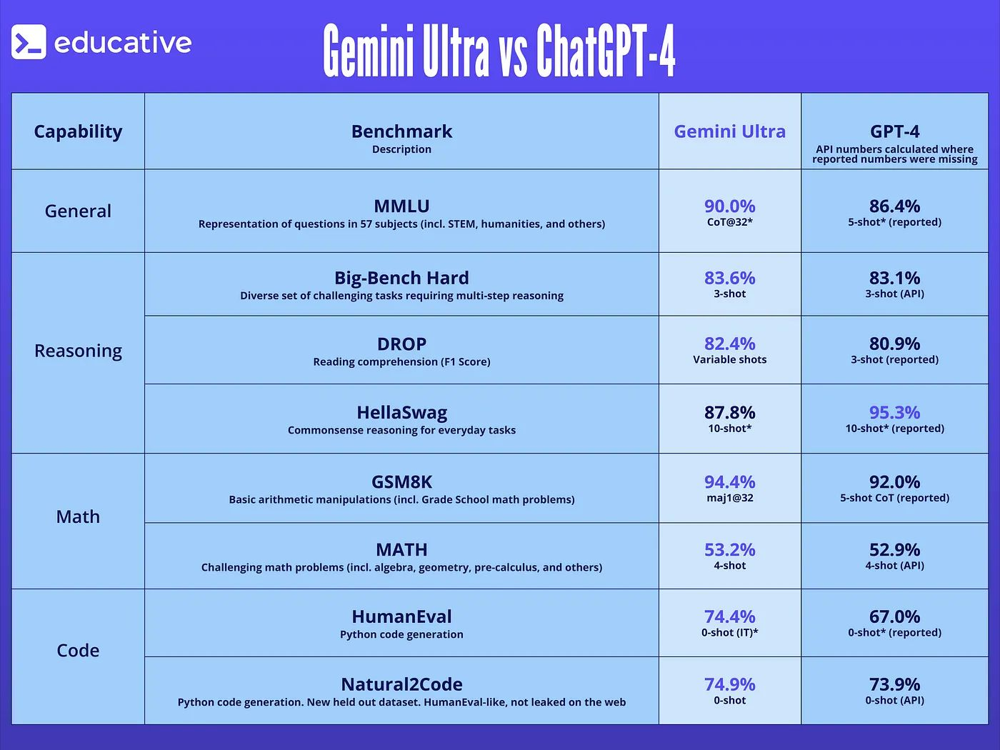
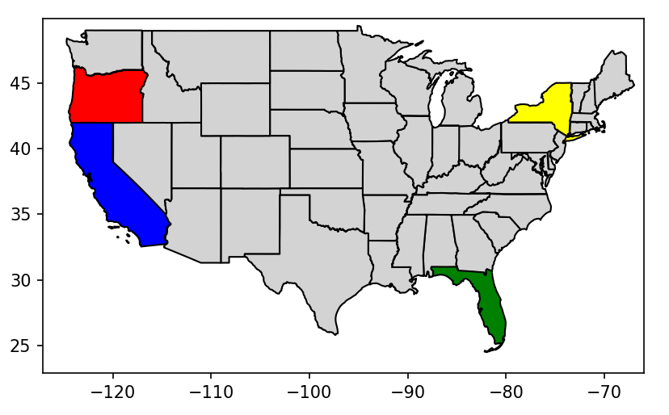
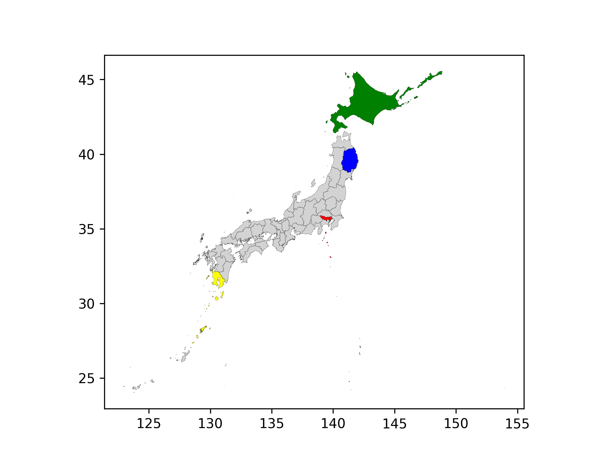
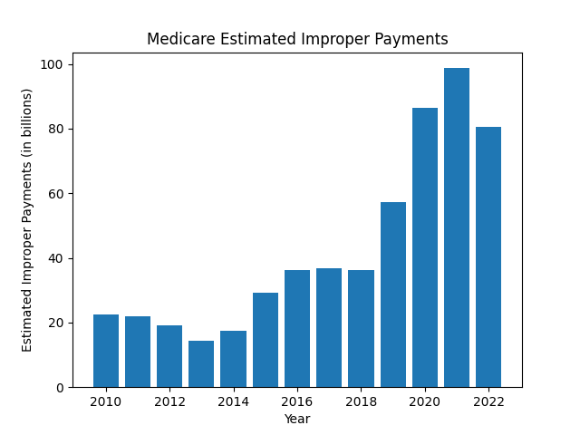
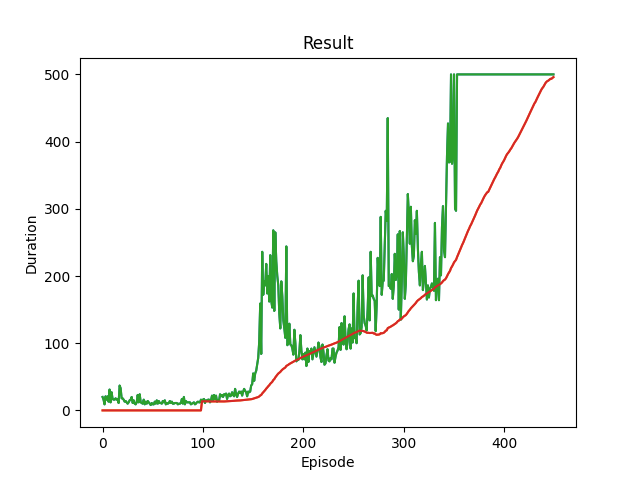
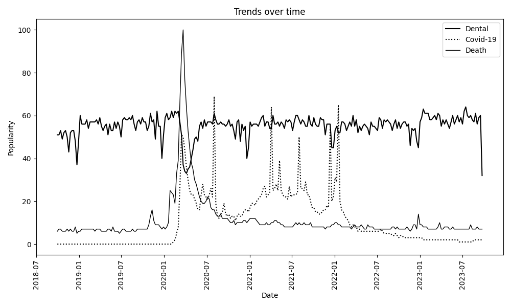
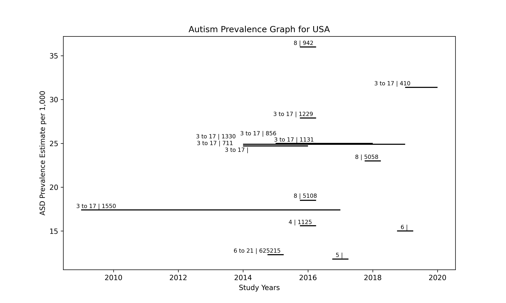
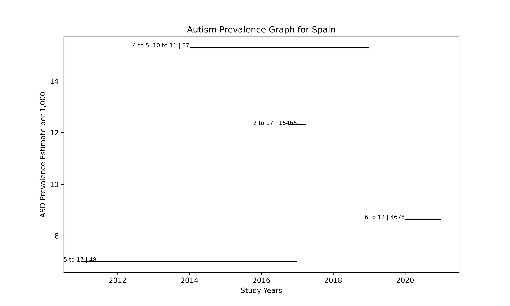
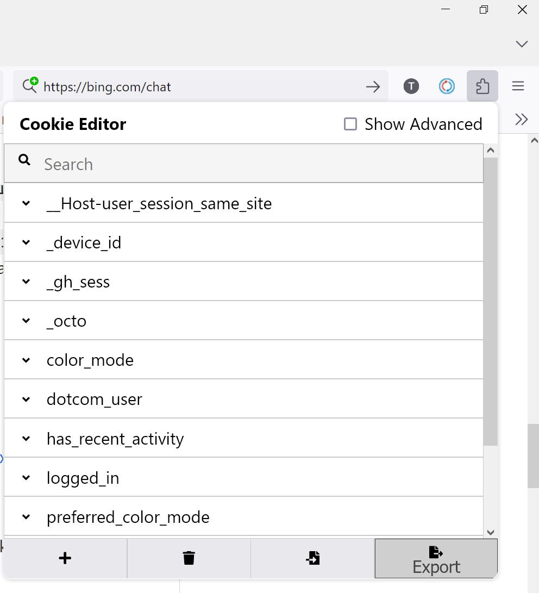

# How to use generative AI systems 

This tutorial is designed to guide Data Science students at Musashino University, Japan, on how to utilize generative AI systems such as Bing.com with ChatGPT-4 and Gemini.

Generative AI systems for dialogue can be broadly classified into two categories: online interactive dialogue AI, which operates via a browser, and terminal command AI, which operates in a batch style. Each type of terminal command AI requires specific settings for use, yet they are all available at no cost.

This repository provides an introduction to four distinct types of dialogue AI systems: Bing.com of Copilot via Edge (ChatGPT-4), and EdgeGPT without a browser, and Google Gemini (with and without a browser). It's worth noting that EdgeGPT is built upon the ChatGPT-4 framework: https://blogs.bing.com/search/march_2023/Confirmed-the-new-Bing-runs-on-OpenAI%E2%80%99s-GPT-4

The following two links are online interactive dialog AI systems via browser for free of charge:

Gemini via any browser: https://gemini.google.com/

Bing.com via Edge browser using ChatGPT-4: https://bing.com/copilot

<b>
You need to practice interacting with the AI to accomplish the desired tasks. Practice makes perfect.
It is important for users to be aware that generative AI may produce inaccurate responses due to insufficient training or the presence of incorrect data. The validity and usefulness of this tutorial on generative AI have been confirmed by published peer-reviewed journal articles. These articles attest to the tutorial's accuracy.
   
</b>

<b>
References: 
</b>

   
1.Takefuji, Y. A brief tutorial on generative AI. Br Dent J 234, 845 (2023). https://doi.org/10.1038/s41415-023-6041-0

2.Takefuji Y. Impact of COVID-19 on mental health in the US with generative AI. Asian J Psychiatr. 2023;88:103736. https://doi.org/10.1016/j.ajp.2023.103736

3.Takefuji Y. An updated tutorial on reproducible PyPI applications for advancing chemometrics and boosting learner motivation. Chemometrics and Intelligent Laboratory Systems. (2023). https://doi.org/10.1016/j.chemolab.2023.104941

4.Takefuji Y. A retrospective cohort study on breast cancer screening: Comparing false-positive and false-negative rates from two BCSC databases. (2023). https://doi.org/10.1016/j.jemep.2023.100938

5.Takefuji Y. Generative AI for analysis and identification of Medicare improper payments by provider type and HCPC code. (2023). Exploratory Research in Clinical and Social Pharmacy. https://doi.org/10.1016/j.rcsop.2023.100387

6.Takefuji, Y. Generative AI for diabetologists: a concise tutorial on dataset analysis. J Diabetes Metab Disord (2024). https://doi.org/10.1007/s40200-023-01377-0

7.Takefuji Y. Vaccine effects on COVID-19 infection with bivalent boosting by age group. Drug Resist Updat. 2024;73:101039. https://doi.org/10.1016/j.drup.2023.101039

8.Takefuji, Y. Exploring Trends in Erectile Dysfunction Research from 2017 to 2023: A Focus on COVID-19, Mental Health, Psychiatry, and Drug. Sex Disabil (2024). https://doi.org/10.1007/s11195-024-09841-2

9.Takefuji Y. Impact of COVID-19 on arthritis with generative AI. Int Immunopharmacol. Published online April 11, 2024. https://doi.org/10.1016/j.intimp.2024.112032

10.Takefuji Y. Leveraging Human-AI Collaboration to Visualize Age-Related Diabetes Features Using Dataset. (2024). Archives of Gerontology and Geriatrics Plus. https://doi.org/10.1016/j.aggp.2024.100025

11.Takefuji, Y., Yamada, R. A New Role of Pseudorandom Number as Inductive Inference for Solving Classic Coin-Weighing Puzzles. SN COMPUT. SCI. 1, 162 (2020). https://doi.org/10.1007/s42979-020-00167-2

12.Takefuji Y. Airborne precautions are needed against COVID-19. J Infect Public Health. 2020;13(6):833. doi:10.1016/j.jiph.2020.05.015

13.Takefuji Y. Japan's government must seek out expert scientists. Nature. 2020;586(7828):200. doi:10.1038/d41586-020-02813-4

14.Takefuji Y. Fourier analysis using the number of COVID-19 daily deaths in the US. Epidemiology and Infection. 2021;149:e64. doi:10.1017/S0950268821000522

15.Takefuji Y. Artificial Intelligence Suggests that UAE Needs to Mitigate the Small COVID-19 Resurgence. Dubai Medical Journal. 2021;4(1):74-76. doi:10.1159/000514590

16.Takefuji Y. Converting detailed estimates to primary estimates with data augmentation. Advanced Engineering InformaticsVolume 49Issue, Aug 2021. https://doi.org/10.1016/j.aei.2021.101354

17.Takefuji Y. Analysis of digital fences against COVID-19. Health Technol (Berl). 2021;11(6):1383-1386. doi:10.1007/s12553-021-00597-9

18.Miyagawa, T., & Takefuji, Y. (2023). A time-series COVID-19 policy outcome analysis tool to measure human behavior from a herd instinct perspective. Health and technology, 1–6. Advance online publication. https://doi.org/10.1007/s12553-023-00759-x

19.Inose I. and Takefuji Y. COVID-19’s impact on drug overdose fatalities and urgent mental health care demand in the US Health and Technology (2024) https://doi.org/10.1007/s12553-024-00876-1

20.Y. Takefuji, Exploring the link between COVID-19 and coronary spasm, Journal of Cardiology Cases, https://doi.org/10.1016/j.jccase.2024.05.001 

21.Takefuji, Y. Oral health's role in disease prevention. Br Dent J 236, 733–734 (2024). https://doi.org/10.1038/s41415-024-7464-y

22.Takefuji, Y. Eye diseases: a global concern across age, race, and environment. Eye (2024). https://doi.org/10.1038/s41433-024-03179-x

23.Takefuji, Y. Worldwide burnout in dentists. Br Dent J 236, 857 (2024). https://doi.org/10.1038/s41415-024-7511-8

24.Takefuji, Y. Recent insights into the prevalence of mental health disorders in the veterinary profession. Research in Veterinary Science, Volume 176, 2024. https://doi.org/10.1016/j.rvsc.2024.105338.

https://learningdaily.dev/google-gemini-vs-chatgpt-everything-we-know-so-far-7af259fe3022

# Examples via browser

The difficulty level is indicated by the number of asterisks (*). The more asterisks, the higher the difficulty. 

<b>
1. Query to AI: show a code in Python to display a graph with data.csv 
   composed of x and y determinants.
</b>

<pre>
Answer from AI:
import pandas as pd
import matplotlib.pyplot as plt

data = pd.read_csv('data.csv')
x = data['x']
y = data['y']

plt.plot(x, y)
plt.show()
</pre>
<b>
2. Query to AI: who is yoshiyasu takefuji?
</b>
<pre>
Answer from AI:
Yoshiyasu Takefuji is a professor at **Musashino University** in the **Data Science** department². He has a Ph.D. and his research interests include cyber-security, machine learning, neural computing, energy harvesting, IoT, automated reasoning, and applied AI². He has developed AI prototypes that outperform super-skilled humans in civil engineering and construction, marketing, skin cancers, and many other areas². Is there anything else you would like to know about him?

Source: Conversation with Bing, 2023/5/13
(1) Yoshiyasu TAKEFUJI | Professor | Ph.D. Professor .... https://www.researchgate.net/profile/Yoshiyasu-Takefuji.
(2) 武藤 佳恭 (Takefuji Yoshiyasu) - マイポータル - researchmap. https://researchmap.jp/ytakefuji.
(3) ytakefuji (Yoshiyasu Takefuji) · GitHub. https://github.com/y-takefuji.
</pre>
Hint:
If AI does not respose to your query well, add an extra word such as Professor or Dr. in your dialog. In other words, ask "who is Professor yoshiyasu takefuji?" 

<b>
3. Query to AI: show a list of publications by yoshiyasu takefuji in 2023.
</b>
<pre>
Answer from AI:
I’m sorry, but I couldn’t find any specific information about publications by Yoshiyasu Takefuji in 2023. Would you like to know about his publications from another year or more general information about his work?
</pre>
<b>
4. Query to AI: show a list of publications by yoshiyasu takefuji in 2023 
   with search query command of "yoshiyasu takefuji site:nih.gov after:2023-1-1"
</b>
<pre>
Answer from AI:
hiscovid for visualizing and identifying when policymakers made mistakes against COVID-19
doi: 10.1016/j.simpa.2023.100466

Review of hikikomori: A global health issue, identification and treatment
doi: 10.1016/j.ajp.2023.103596
</pre>
<b>
5. Query to AI: summarize them.
</b>
<pre>
Answer from AI:

hiscovid for visualizing and identifying when policymakers made mistakes against COVID-19

This paper presents a new tool called hiscovid that can be used to visualize and identify when policymakers made mistakes against COVID-19. hiscovid uses a time-series policy outcome scoring tool to evaluate the outcomes of COVID-19 policies by country. The daily cumulative population mortality is used for scoring the outcomes of COVID-19 country policies. hiscovid allows policymakers to observe the progress and transition of scores over time to learn lessons from the past decision-making mistakes for correcting the current policies to reduce unnecessary deaths.

Review of hikikomori: A global health issue, identification and treatment

This paper reviews the literature on hikikomori, a Japanese term for a condition in which people withdraw from social contact and isolate themselves in their homes for extended periods of time. Hikikomori is a global health issue, with an estimated 1.5 million people in the United States and 1.2 million people in Europe affected by the condition. The paper discusses the identification and treatment of hikikomori, and provides recommendations for future research.
</pre>
<b>
6.** Draw the age group circles where the center point of each circle indicates the average of HbA1c, and the size of each circle is the number of participants after calculating the average HbA1c for each age group with the following dataset.
</b>

Download the dataset from the following site:

https://data.mendeley.com/datasets/g7gzwd4c7h

Reference: Maw, Su Su; Haga, Chiyori (2018), “Dataset for lifestyle behaviors and HbA1c status from 2012 to 2014 of Japanese middle aged and elder people”, Mendeley Data, V1, doi: 10.17632/g7gzwd4c7h.1

ask AI to show a code in Python to create and save a graph of "HbA1c" vs "Age" with the downloaded dataset: data.csv. Calculate the average HbA1c for each age group and draw a circle for each age group. The center point of the circle indicates the average of HbA1c, and the size of the circle is the number of participants in the age group.

Hint:
The range of "Age" values is from 40 to 74. The range of "HbA1c" values is from 3.5 to 12.9. 

The following diagram is produced by the AI-created program in Python.

<b>
7.0* Show a full code in Python to draw a graph of 4 country lines from 2000 to 2022 with SIPRI-Milex-data-1949-2022.csv
</b>

Hint: Identify 'Country' column name.

https://github.com/ytakefuji/generativeAI/blob/main/SIPRI-Milex-data-1949-2022.csv

<b>
7.1** Make a code in Python to visualize military spending of up to 4 countries from 2000 to 2022
   with the following xlsx file. 4 lines of the graph is colored with black and white. User is allowed to enter up to 4 countries from the terminal.
</b>

https://www.sipri.org/sites/default/files/SIPRI-Milex-data-1949-2022.xlsx

Hint: explain to AI on how to extract the important data from the xlsx file to visualize time-series data of up to 4 countries.

<b>
8.* Solve it using real numbers and complex numbers respectively: x - 2y = 0 and x^2 - y^2 = -3.
</b>

Hint: no hint.

<b>
9.* Draw a US-state map with red Oregon, blue California, green Florida, yellow New York and lightgray others.
</b>

Hint: use geopandas.

<b>
10.** Draw a Japan-prefecture map with green Hokkaido, blue Iwate, red Tokyo, yellow Kagoshima and lightgray others.
</b>

Hint: use geopandas and find a Japan prefecture map.

<b>
11.**** show two codes in Python how to upload and download a csv file on your account of Facebook, LinkedIn or Line for sharing it within group members while the current SNS platforms do not allow users to upload/download a csv file. There is no menu to upload a csv file.
</b>

Hint: no hint.

<b>
12.** Find 6-letter lowercase words of the alphabet without "aeiou" and 5-letters lowercase words without "aeiou". A word should not contain a repeated letter.
</b>

Hint: no hint.

<b>
13.** Use the following datasets on the global temperature and CO2. Calculate the correlation and discuss the global warming with human-induced CO2.　Don't be preconceived in research
</b>

Use the following site which contains the latest data with every month updated.

https://www.ncei.noaa.gov/data/noaa-global-surface-temperature/v5.1/access/timeseries/

The following link is lost.

https://www.ncei.noaa.gov/data/noaa-global-surface-temperature/v5.1/access/timeseries/aravg.mon.land_ocean.90S.90N.v5.1.0.202304.asc

https://www.ncei.noaa.gov/data/noaa-global-surface-temperature/v5.1/access/timeseries/aravg.mon.land_ocean.90S.90N.v5.1.0.202305.asc

Use the global monthly co2 data:

ftp://aftp.cmdl.noaa.gov/products/trends/co2/co2_mm_mlo.csv
 

Hint:

1. convert co2_mm_mlo.csv to co2.csv with three columns such as 'year', 'month' and 'mean'.

2. Cope with monthly updated file-name changes to download the correct latest data.

3. Similarily, convert aravg.mon.land_ocean.90S.90N.v5.1.0.202305.asc to temp.csv with three columns such as 'year', 'month' and 'change'.

4. plot a graph of two lines of co2 and temperature from 1940 to 1967.

<b>
14.** Make a scorecovid application for calculating scores of selected countires with dividing the number of cumulative deaths by the population per million and sorting scores in ascending order.
</b>
   
Many COVID-19 datasets are not being updated anymore. However, WHO is now handling COVID-19 dataset:
https://covid19.who.int/WHO-COVID-19-global-data.csv

Use the population data at:
https://github.com/ytakefuji/score-covid-19-policy/raw/main/country-pop.csv

<pre>
$ scorecovid
Latest date: 2023-06-07
             country  population  deaths  score
United Arab Emirates     9441129    2349    248
         New Zealand     5185288    2942    567
               Japan   123951692   74694    602
             Iceland      372899     260    697
           Australia    26177413   21063    804
              Canada    38454327   52645   1369
              Israel     9038309   12540   1387
             Germany    83369843  174412   2092
              Sweden    10549347   24371   2310
              France    64626628  163680   2532
              Brazil   215313498  702907   3264
       United States   338289857 1127152   3331
      United Kingdom    67508936  226645   3357
             Hungary     9967308   48789   4894
</pre>

<b>
15.*** Draw a graph based on Bayesian theory to calculate the probability of detecting someone is positive. 
</b>

Assume that the probability of individual with disease is 0.065 and non-infected population probability is 0.935. 

Assume the true positive rate of testing is 0.991 and the false positive rate is 0.0005. 
Formulate the probability of detecting someone is positive: P(x,y) where x and y are the false positive rate and the true positive rate respectively.

Hint: no hint

<b>
16.** Use rows.csv: https://data.cdc.gov/api/views/3rge-nu2a/rows.csv and 
show the effectiveness of vaccination with symptoms by age groups.
</b>

Hint: no hint

<b>
17.* draw a graph of the following with data.csv.
</b>

<pre>
$ cat data.csv
factor,value
A,5
A,7
A,8
B,2
B,4
B,6
C,1
C,3
C,5
</pre>

Hint: Each boxplot in a graphical indicates representation of the distribution of a dataset with the median, quartiles, and outliers of the data.

<b>
18.* Draw a graph of the following csv file without modifying csv contents.
</b>

use [medicare.csv](https://github.com/y-takefuji/generativeAI/blob/main/medicare.csv)

The result should be shown.

<pre>
$ cat medicare.csv
Year,PERM Cycles Included,Estimated Improper Payments (in billions),Overall Rate,FFS Rate,Managed Care Rate,Eligibility Rate
2010,Cycle 2 – FY 2007,$22.50 ,9.40%,4.40%,1.00%,5.90%
,,,,,,
,Cycle 3 – FY 2008,,,,,
,,,,,,
,Cycle 1 – FY 2009,,,,,
2011,Cycle 3 – FY 2008,$21.90 ,8.10%,2.70%,0.30%,6.00%
</pre>

<b>
19.** Breast cancer screening between 1994-2009 and 2007-2013. 
   Use two sites and discuss false-positive and accuracy for comparison.
</b>

https://tools.bcsc-scc.org/dataexplorer/

https://www.bcsc-research.org/statistics/diagnostic-performance-benchmarks/diagnostic-mammography-sensitivity-specificity

Hint: pick 'Exam' for "Count by" and 'Screening mammogram classification' for "Screening mammography performance and cancer rates" for 1994-2009. 
Calculate false-positive and accuracy for 2007-2013.

<b>
20.* Predict cross-validation accuracy of binary classification of 'Group' in the dataset.
   And show top-5 feature importances.
</b>

https://dfzljdn9uc3pi.cloudfront.net/2022/14078/1/raw_data.csv

<b>
21.* What is the probability that she actually has breast cancer with positive mammogram? 
</b>

1% of women at age forty who participate in routine screening have breast cancer. 80% of women with breast cancer will get positive mammograms. 9.6% of women without breast cancer will also get positive mammograms. A woman in this age group had a positive mammography in a routine screening. 

Hint: Bayesian theory

<b>
22.*** Download the program for cartpole control with reinforcement learning. Replace the value at line 403 from 50 to 250. Ensure that the program produces the same result every time it is run by removing any reproducibility issues.
Save the DQN neural network and the plotted figure.
</b>
   
https://raw.githubusercontent.com/pytorch/tutorials/main/intermediate_source/reinforcement_q_learning.py

Hint: no hint.

<b>
23.*** In the previous problem, save states and actions as X and y as dataset 
   which can be used for different machine learning algorithms for comparison.
</b>

Hint: no hint.

<b>
24.* Google Trends is a website by Google that analyzes the popularity of top search queries in Google Search across various regions and languages. It shows how often a particular search term is entered relative to the total search volume across various regions of the world, and in various languages. Make a graph of three lines with keywords such as dental, death and COVID-19.
</b>

<b>
25.** Investigate why the asbestos problem cannot be solved in our society, where the first death due to asbestos was reported in 1906. Discover a promising solution.
</b>

Hints: Check the asbestos history and trends of asbestos issues.

<b>
26.* Example: A healthcare provider utilizes a blood test to determine whether or not patients will have a disease. 
The results are the following:
A total of 1,000 individuals had their blood tested.
Four hundred twenty-seven individuals had positive findings, and 573 individuals had negative findings.
Out of the 427 individuals who had positive findings, 369 of them had the disease.
Out of the 573 individuals who had negative findings, 558 did not have the disease.
Let’s calculate the sensitivity, specificity. We first can start with a 2X2 Table. The information above allows us to enter the values in the table below. Notice that values in blue cells were not provided, but we can get them based on the numbers above and the utilization of total cells. 
The provider found that a total of 384 individuals actually had the disease, but how accurate was the blood test?

</b>

Hint: no hint

<b>
27.*** Investigate the current resuscitation procedure and find evidences to enhance the survival rates with the updated procedure.
</b>

Hint: CPR->AED?

<b>
28.** Find the dataset and compute the infection protection with bivalent vaccination by age group.
</b>

Hint: CDC dataset

<b>
29.** Create a universal biomarker prediction tool for patients. A graph is composed of two lines for two independent biomarkers (one on the left vertical axis and the other on the right axis) while the horizontal axis represents date.
</b>

Hint: no hint

<b>
30.* Download the csv file (autism_prevalence_studies_XXXXX.csv) 
   and draw a graph of autism prevalance from the following site:
   https://data.cdc.gov/Public-Health-Surveillance/autism-prevalence-studies/9mw4-6adp/about_data

   The program allows users to select one country name and draw a line with the range of investigated year(s). 
   The line length is determined by the start and the end year. Print targeted age(s) with vertical bar and the number of cases.

<b>31.**In the world, global warming and sea level rise are causing a stir, but there are also places where sea level fall is being measured. Find the dataset and create graphs as many examples as possible. 

Hint: NOAA.
</b>

<b>32.****While Volatile Organic Compounds (VOCs) are pollutants that can harm human health, they can also produce ozone (O3) when radiated by the sun. This ozone, known as ground-level ozone, plays a significant role in our atmosphere. In the tropics, ozone ascends to the upper atmosphere through a process called the Brewer-Dobson circulation. If we could develop new technology to mitigate the tropopause—the boundary between the troposphere and the stratosphere—we might be able to enhance the thickness of the ozone layer in the upper atmosphere, potentially offering greater protection against skin cancer. The creation of such technology would be a testament to human ingenuity, turning a negative phenomenon into a beneficial one. Let’s brainstorm some ideas for this new technology. 
</b>

<b>33.**The 2007 Nobel Peace Prize was shared, in two equal parts, between the Intergovernmental Panel on Climate Change (IPCC) (founded in 1988) and United States former vice president, Al Gore. In 2021, the Nobel Prize in physics was awarded to scientists Syukuro Manabe of the United States and Klaus Hasselmann of Germany for work that laid the foundation for current climate models. Numerous studies have highlighted the significant role of human-induced CO2 emissions in contributing to global warming. However, the COVID-19 lockdowns have led to a substantial reduction in these emissions. Specifically, during the peak of the lockdowns, human-induced CO2 emissions were reduced by approximately 60%. To gain a deeper understanding of this phenomenon, it is crucial to examine relevant datasets and discern the truth. During the lockdowns, NOAA datasets suggest that global CO2 emissions including natural and human-induced CO2 increased.
</b>

# Challenging EXAMPLES
<b>
1.***** This is called a perfect pangram generator. Use all 26 lowercase letters of the alphabet only once to create a meaningful sentence. This is a difficult problem!
</b>
   
Answer from AI should be, for example:

Mr. Jock, TV quiz Ph. D., bags few lynx.

Cwm fjord bank glyphs vext quiz.

<b>
We finally made a pangram generator and created new perfect pangrams.

1. Fez, Jud know strych pilm, vag BQX.

strych pilm=dust at the attic, to vag = to trail on the ground, BQX=Brooklyn Queens Connector
   
2. TCK, Find sphex jow, glazy bum, QRV?

TCK=third culture kid, sphex=insect, jow= hit or strike, bum=british slang: buttocks, QRV=are you ready?
   
3. V? Pry jokish cwm, flag bed, Untz QX?

V=to show sarcasm or humor, pry=inquire, cwm (chat with me), flag=relax, Untz=electric drum sound, QX=Roger
</b>

<b>
2.***** Design a 3-input 3-output combination logic circuit that negates the 3 input signals. Any number of AND and OR gates can be used, but only two NOT gates are allowed.
</b>
   
<pre>
Input	Output
000	111
001	110
010	101
011	100
100	011
101	010
110	001
111	000
</pre>
<b>
3.***** Write a code in Python to solve the 12-coin-3-weighing puzzle. In 12-coin-3-weighing puzzle, twelve coins are given where eleven of which are identical. If one is different, we don't know whether it is heavier or lighter than the others. The balance may be used three times to determine if there is a unique (counterfeit or fake) coin to isolate it and determine its weight relative to the others.
</b>
   
# Terminal command AI with ChatGPT

trans.py with ChatGPT-3 is an example of translation from English to French and Japanese.
The text message "Translate this into 1. French and 2. Japanese:\n\nWhat rooms do you have available?\n." is fed to openai to generate the response.

<pre>
1.API key:
https://platform.openai.com/account/api-keys
open account to obtain API key for OpenAI

2. $ pip install openai

3. $ cat trans.py
# -*- coding: utf-8 -*-
import openai

openai.api_key ="API-key"

res = openai.Completion.create(
  model="text-davinci-003",
  prompt="Translate this into 1. French and 2. Japanese:\n\nWhat rooms do you have available?\n.",
  temperature=0.3,
  max_tokens=100,
  top_p=1.0,
  frequency_penalty=0.0,
  presence_penalty=0.0
)
print(res['choices'][0]['text'])

4. $ python trans.py
1. Quels salles avez-vous disponibles?
2. どの部屋が利用可能ですか？

</pre>

# Exercises
1. Interacting with ChatGPT generates a program (ask.py) in Python for interactively asking user's question and the temperature setting with ChatGPT and returning the response.

Hint: The temperature is a determinant of randomness from 0.0 to 1.0 to control the randomness. The larger the temperature, the greater the randomness.

2. Create a english-to-japanese translator in Python by ChatGPT.

3. Create a program to collect a list of peer-reviewed papers on the specific subject given from a user.

# EdgeGPT from terminal command
EdgeGPT takes advantage of the new version of Bing (Microsoft search engine)
with ChatGPT-4.0. The installation of EdgeGPT is detailed as follows.

1. $ pip install EdgeGPT

2. Install the latest Edge browser.

3. With Edge, open https://bing.com/chat site.

4. Install Cookie-Editor for Edge.

5. Make sure accessing bing.com with Edge.

6. From Extensions, click Cookie-Editor

7. Click Export icon of Cookie-Editor

This will copy the cookie to clipboard.

8. Paste the clipboard to the cookies.json file.

9. Run the following program.
<pre>
import asyncio
from EdgeGPT import Chatbot

async def main():
    bot = Chatbot(cookie_path='cookies.json')
    print(await bot.ask("who is yoshiyasu takefuji?"))
    await bot.close()

if __name__ == "__main__":
    asyncio.run(main())
</pre>

# Exercise
0. Make sure cookie-editor in edge browser showing your cookies, not empty. To show the content of cookie-editor, after logging into your Microsoft account at the Edge, you will need to access bing.com.

1. Write a program (edge.py) for interactively asking a question to EdgeGPT and returning the response.

2. Give the text of "solve x +  y = 3 and 2 x + y = 2, and verify it" to your program until the answer shows the right answer of x and y.

HINT: 
If you have incorrect results, conversation_style must be set in your program.

3. Give the following text "show email for yoshiyasu takefuji" to show the right email address.

4. Write a program in Python to collect a list of peer-reviewed papers on the specific subject.

5. Compare the performance between ChatGPT-3 and EdgeGPT about the above problem.

# Google search console API example
The Google search capability for the latest information can be used with AI to strengthen the wiser system.

1. Create your Google Cloud account and enable custom search to obtain your unique API key.
https://console.cloud.google.com/cloud-resource-manager

2. Enable custom search service. To obtain Google CSE ID, access to https://cse.google.com.

<pre>
from googleapiclient.discovery import build
import json

GOOGLE_CSE_ID='your unique cx'
GOOGLE_API_KEY='enabled search API KEY'
API_SERVICE_NAME = 'searchconsole'

def gsearch(keyword, num=10):
    search_service = build("customsearch","v1",developerKey=GOOGLE_API_KEY)
    response = search_service.cse().list(
                q=keyword,
                cx=GOOGLE_CSE_ID,
                lr='lang_en',
                num=num,
                start=1
            ).execute()
    res = json.dumps(response, ensure_ascii=False, indent=4)    print(res)

if __name__ == '__main__':
    keyword = input("enter your question: ")
    gsearch(keyword)
</pre>

# Exercise
1. Run the above code.

2. Create a new application with combining Google search API and EdgeGPT API.

# Bard by Google via browser
Access to https://bard.google.com/

1. ask "who is yoshiyasu takefuji with a google search command "yoshiyasu takefuji".

2. ask "who is yoshiyasu takefuji with a google phrase search command "yoshiyasu takefuji".

3. ask 'use google search with a search phrase command "yoshiyasu takefuji" and find who is yoshiyasu takefuji.'

4. use the google search phrase-site-command with "yoshiyasu takefuji site:nih.gov" and show the result of publications published after 2021 with single-authored as many as possible and verify them with obtained DOIs respectively.

5. make a new interesting application with Bard.

# BARD from terminal line command

1. Access to https://bard.google.com/ with Chrome and use cookie-editor to get "__Secure-1PSID".

2. export BARD_QUICK="true"

3. export BARD_SESSION= <value of "__Secure-1PSID">

4. pip install GoogleBard

5. run the following command on terminal:

$ python -m Bard "use google phrase search with 'yoshiyasu takefuji' and find who is yoshiyasu takefuji?"

# Exercises
1. Interacting with ChatGPT, Bing.com or EdgeGPT, and Bard respectively makes a cookie editor 
in Python for Chrome on your operating system to show all information of cookies and extract 
the value of "__Secure-1PSID".

2. Compare their performance.

3. Solve it: x + y = 3 and 2 x + y = 2.

4. Make an exciting application in Python with interacting generative AI such as ChatGPT, bing.com or EdgeGPT, or Bard. All conversations with the AI should be noted and the conversations will be included in the comments before the generated program. The new and exciting features of the result generated by your program using generative AI should be clearly stated.

Hints: 

A. Understanding text in English with ChatGPT-4 is 85.5% while one in Japanese is 79.9%.

B. You need to choose right words and phrases in dialog with AI (ChatGPT-3, bing.com with ChatGPT-4 and Bard). Add extra words and/or phrases in your dialog.

C. Multiple conversations may be necessary.

https://www.nature.com/articles/s41433-023-02563-3/figures/1

